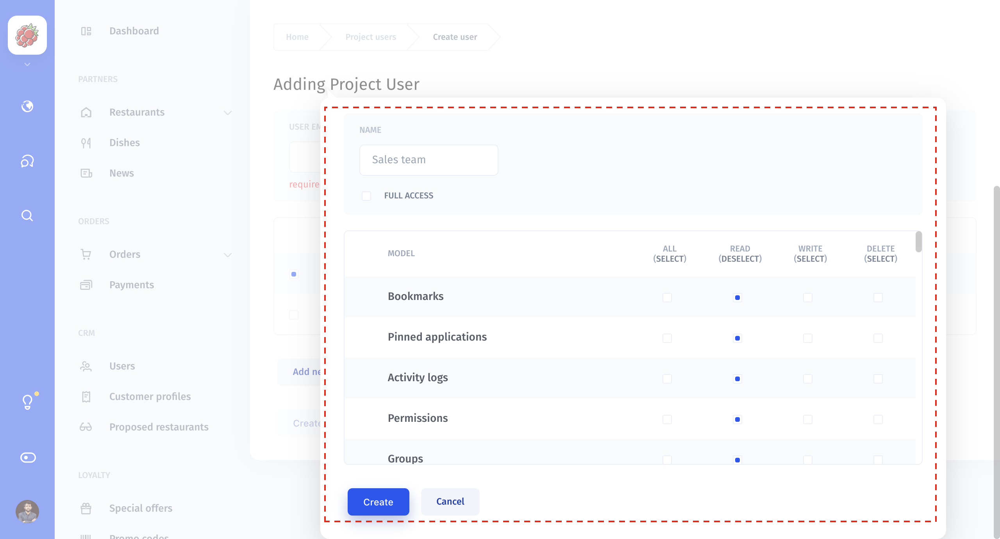
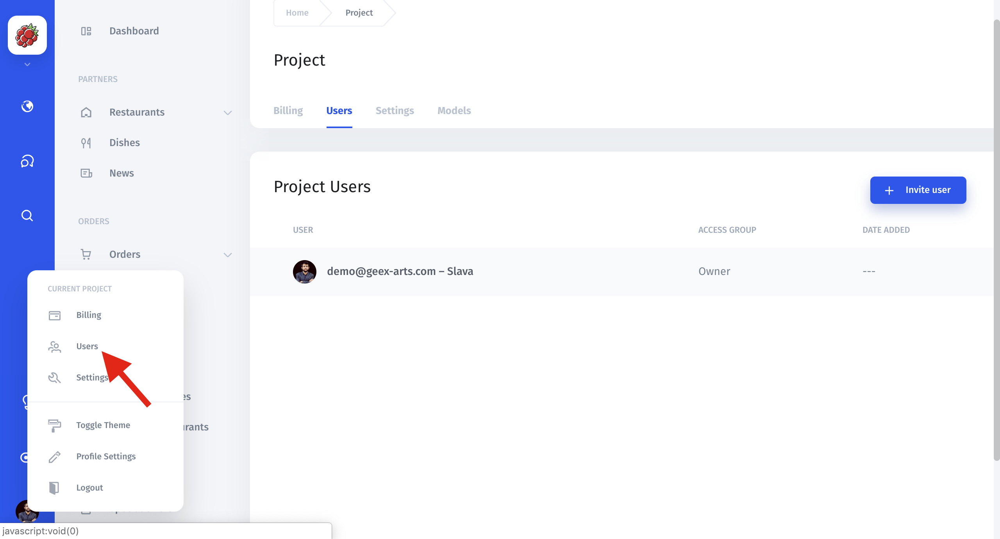
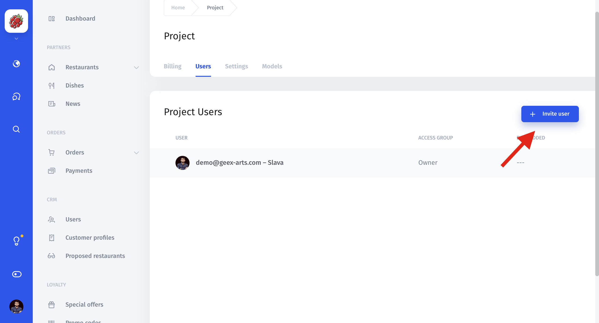
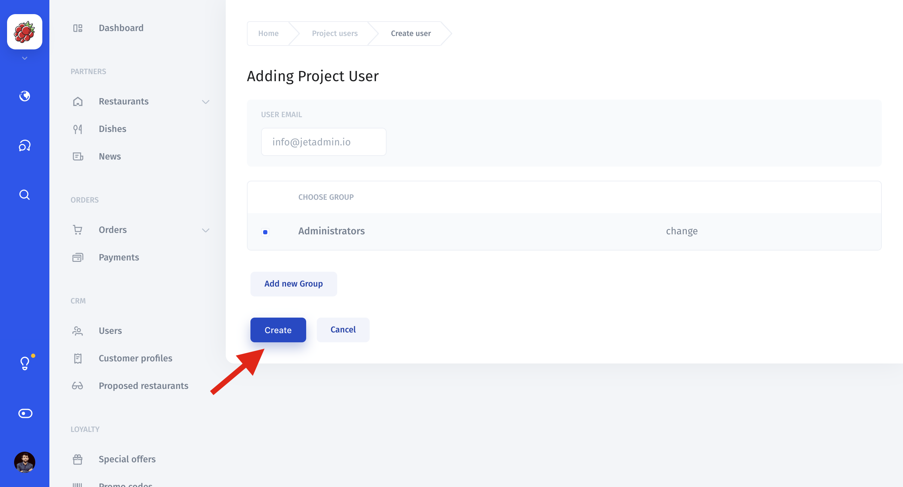

# Team managment

You can easily configure the interface of your teams to:

* Give limited access to your employees or contractors.
* Optimize the admin interface per business unit: success, support, sales or marketing teams.

### Creating a team


**PRO feature**


Teams are created in the invitation. Clicking on the ‘Users’ tab, click on 'Invite user' will allow you to see the existing teams and create a ‘New team’ if needed.

When you create a ‘New team’, you just need to pick a ‘Name’ and collection permissions. Do not forget to ‘Save changes’ in the end of the process.

### Adding a member to an existing team

Adding a new member is easy. Go in your project settings, choose 'Users' tab, click on ‘Invite user’**,**  than fill the field ‘User email’, select a team or create a new team and then click on 'Invite'.

User roles determine the access level or permissions of your teammates. Jet Admin allows you to setup three different kinds of user ‘Roles’.

* **Administrators** - can access project settings \(manage teams, users roles and environments\), customize the admin UI \(activate layout editor\) and manage data.
* **Editor** - can customize the admin UI \(activate layout editor\) and manage data.
* **User** - can manage data only.

