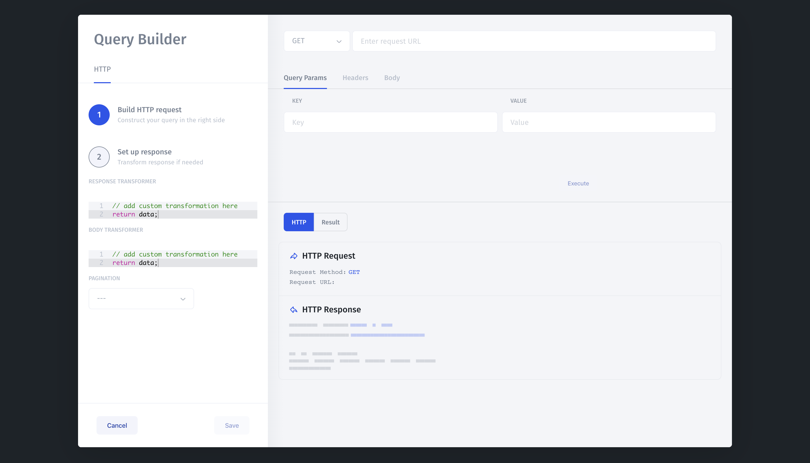
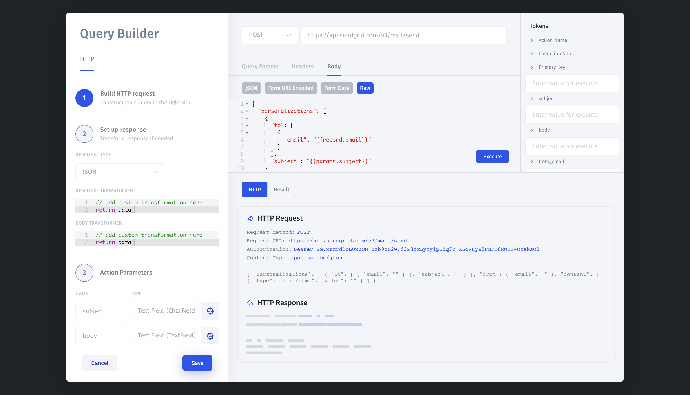
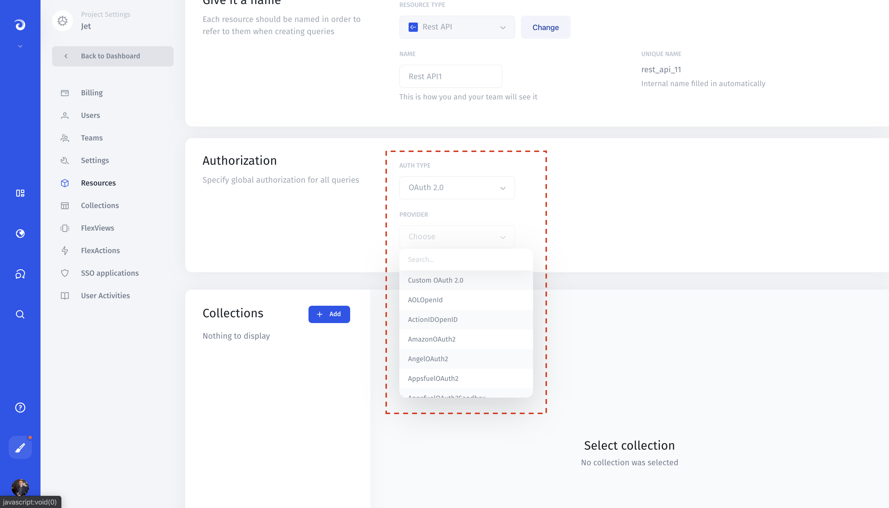
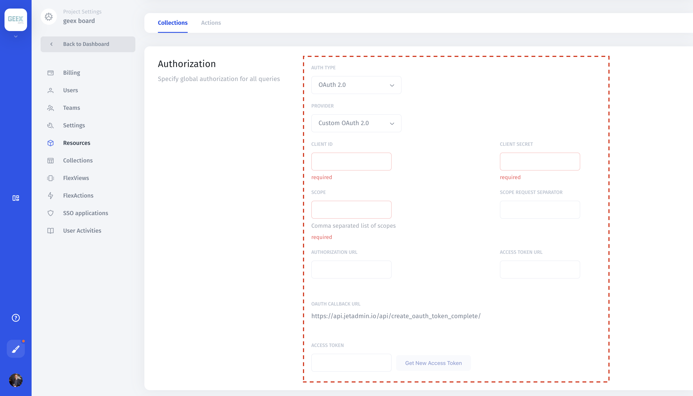
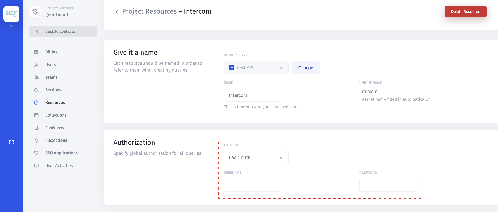

# Rest API

You can make requests to any HTTP API with Jet Admin. Many developers get data from their own internal APIs, render them in `Table`s, then `post` data \(like resetting passwords\) back again to their own API. But you can also connect Jet Admin to APIs like Stripe, Salesforce, Slack, etc.

You query REST resources in an interface where you can set URL params, headers and cookies:

## Create an action

**Settings &gt; Flex Action &gt; Add** 

Choose a Resource or[ create a new](./) and specify action details: Name, Type. 

Define request by specifying query parameters: method \(GET, POST, ...\), URL,..

## API Authentication

### OAuth 2.0

Jet Admin also supports OAuth 2.0 authentication scheme. Unlike the previous examples, authentication details are _not_ shared between your end users.

Each of your end users will be required to authenticate via the OAuth authentication flow. The Access/Refresh token that is returned by the OAuth identity provider will be encrypted and then associated with the user's current session with Jet Admin. This allows you to delegate authorization and authentication to the OAuth Identity provider.

Here is a sample configuration of Jet Admin connecting with Google's OAuth 2.0 API. Things to take note of:

* We added the header: `Authorization: Bearer {-oauth_access_token-}` - the `{-oauth_access_token-}`  is a magic placeholder string that gets replaced with the access token at runtime. You can use this magic string in the header or in the URL parameters of the query.
* The OAuth Callback URL is static and cannot be changed - you must use this URL and provide it to the OAuth configuration.
* The Login Test URL is used to test whether or not the user is currently authenticated. Jet Admin will make a `GET` request to the URL and if the response is not a `20x`, it will pop a modal open and ask the user to authenticate against the API.

### 

### Authorization bearer token

Adding an API that uses a bearer token authentication scheme is easy in Jet Admin. Just add it as a global header in the Resource configuration screen and all your API requests that use the resource will have the right auth headers sent over.

### Basic Authorization

To enable Basic Auth authentication schemes, choose `Basic Auth` in the `Authentication` dropdown and then provide the username and password.

## Define collections and query for your Rest API

