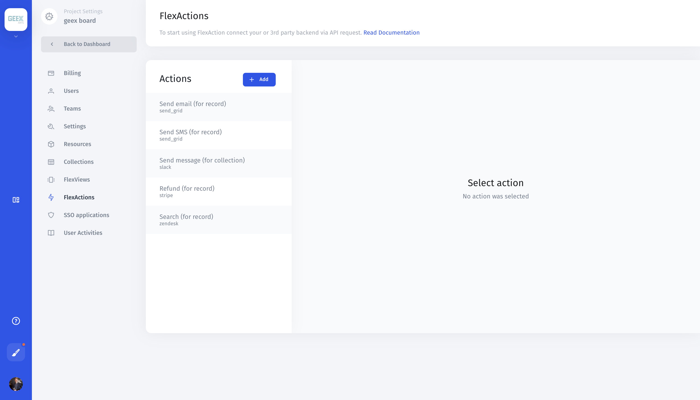
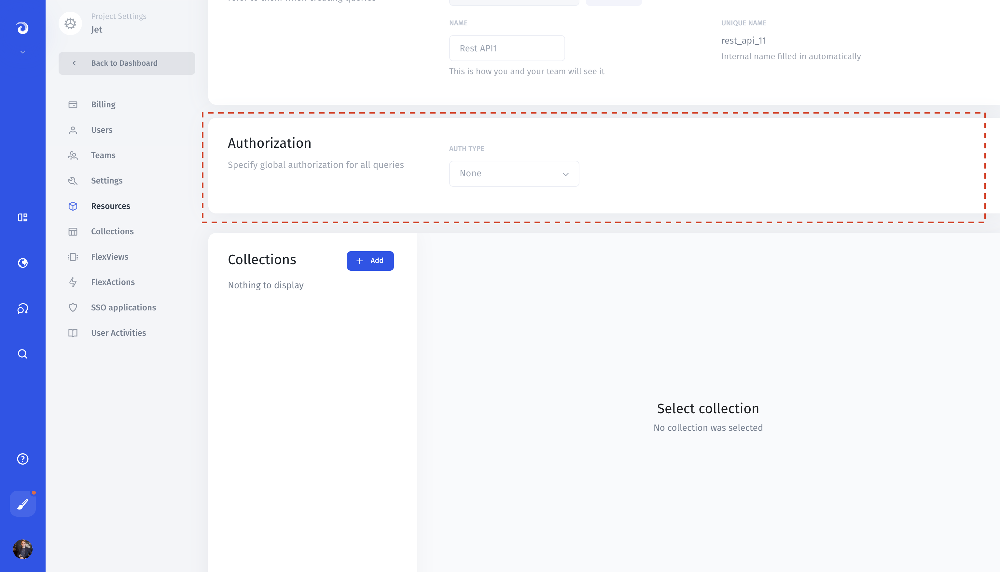

# Rest API

You can make requests to any HTTP API with Jet Admin. Many developers get data from their own internal APIs, render them in `Table`s, then `post` data \(like resetting passwords\) back again to their own API. But you can also connect Jet Admin to APIs like Stripe, Salesforce, Slack, etc.

You query REST resources in an interface where you can set URL params, headers and cookies:

## Create an action

**Settings &gt; Flex Action &gt; Add** 

Choose a Resource or[ create a new](./) and specify action details: Name, Type. 

Define request by specifying query parameters: method \(GET, POST, ...\), URL,..

## API Authentication

### OAuth 2.0

### Authorization bearer token

Adding an API that uses a bearer token authentication scheme is easy in Jet Admin. Just add it as a header in the Query.

## Define collections and query for your Rest API

