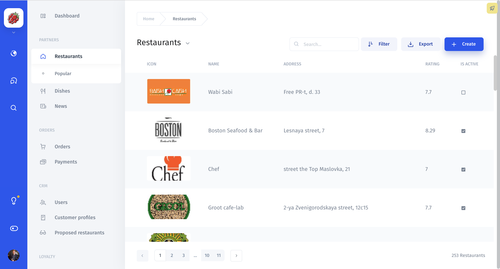

# Overall Structure

### Understanding collections

In Jet Admin, your data is divided into several data tables relevant to your business, such as : Restaurants, Dishes, Orders, etc… We call each data table a collection **\(1\)**

You can display as many collections as you want in the left panel list. Your developers may have narrowed this list of visible collections to just a few ones. In a further section called ‘Organize’ you will see how you can change this setup if needed for your operations.

### Understanding fields

All records of the same collection share the same fields. For example, each company will have a specific Icon **\(1\)**, Name **\(2\)**, Address **\(3\)**, Rating **\(4\)**, et

In the Jet Live demo, we chose to have a limited number of attributes, but this is not mandatory. In fact, you can have as many Fields as you want. Having a lot of fields only means that you will have to move laterally to visualize your columns.

### Accessing a record

After browsing through the table view of a Collection, you might want to dig further into a specific record. Click on a specific row **\(1\)** to display a record’s page **\(2\)**

