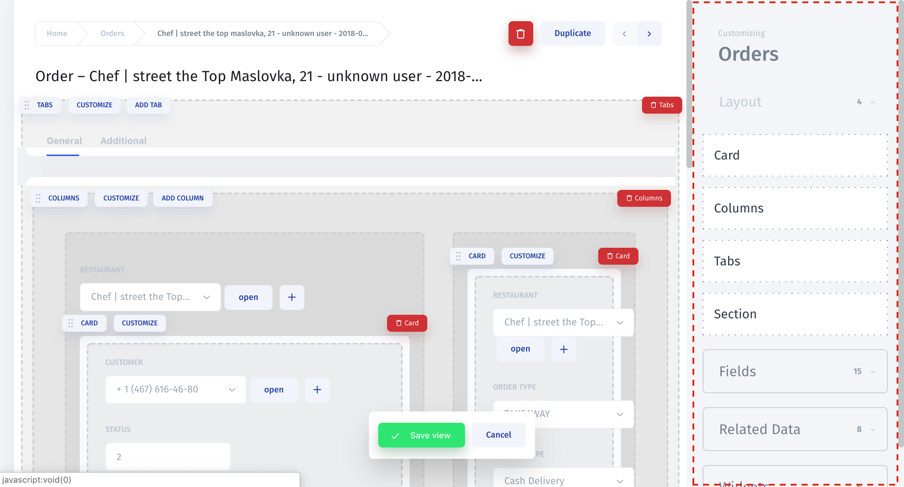
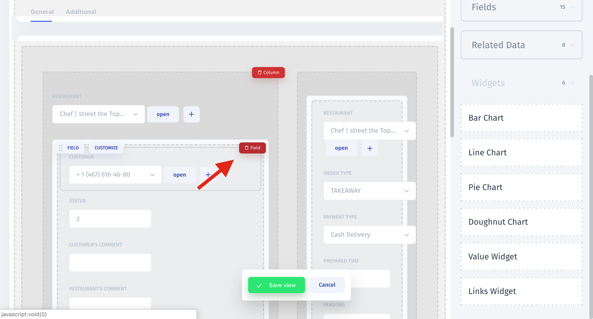
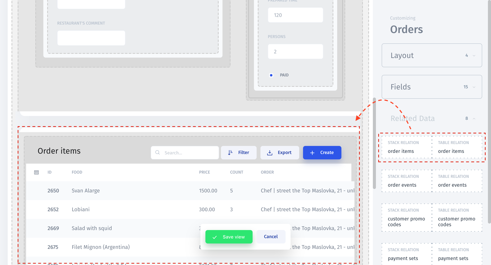
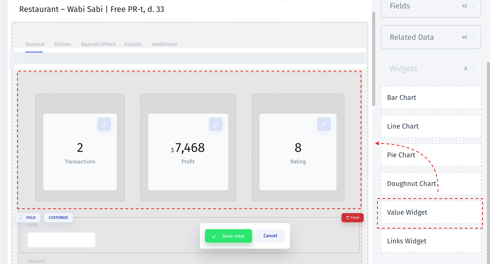

# Customize Detail View

### Enable Customize Mode

To start customizing interface directly from your browser:

1. Click **Customize Interface** button
2. Choose which section you want to customize **\(1\)**, **\(2\)** or **\(3\).** Depending on which page you are on sections **\(2\)** and **\(3\)** can change


You can begin customization. You can find more about possible customization in next sections of this page.


### Saving changes when in Customize Mode

Once you have finished with customization don't forget to save changes with **Save button** at the bottom center of the screen.

### Organizing your data layout with the Visual builder

To activate **Visual Builder** by clicking on the edit button to customize your Detail view.

The builder works as a standard drag and drop tool. It is divided into five categories: 

* Layouts: card, columns, tabs, sections.
* Fields. All fields from selected collection.
* Related data. All related tables from selected collection. Related tables automatically 
* Widgets. Jet provide you to track KPI from specific record using Charts\(Bar, Line, Pie, Doughnut\), Value and Links widgets.
* Actions. Perform any operations on you record. To use actions coming from the Action section: 

Add first a “Layout” from the layout category and fill it with related fields.

If you wish to delete a Section or a Module from your Summary view, simply hover your mouse on selected element and click trash button.

### Accessing related data

In the related data category, you will find all fields associated to your record. For example in the demo, a order has many order items, so you find ‘Order Items’ in the related data section. Adding a related data field works exactly the same way as other modules in the builder: just drag and drop it where you want.

### Track record KPI

In the related data category, you will find all fields associated to your record. For example in the demo, a order has many order items, so you find ‘Order Items’ in the related data section. Adding a related data field works exactly the same way as other modules in the builder: just drag and drop it where you want.

